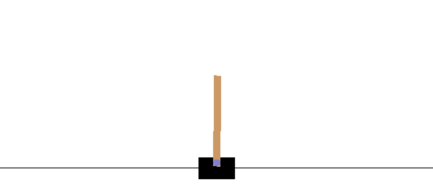
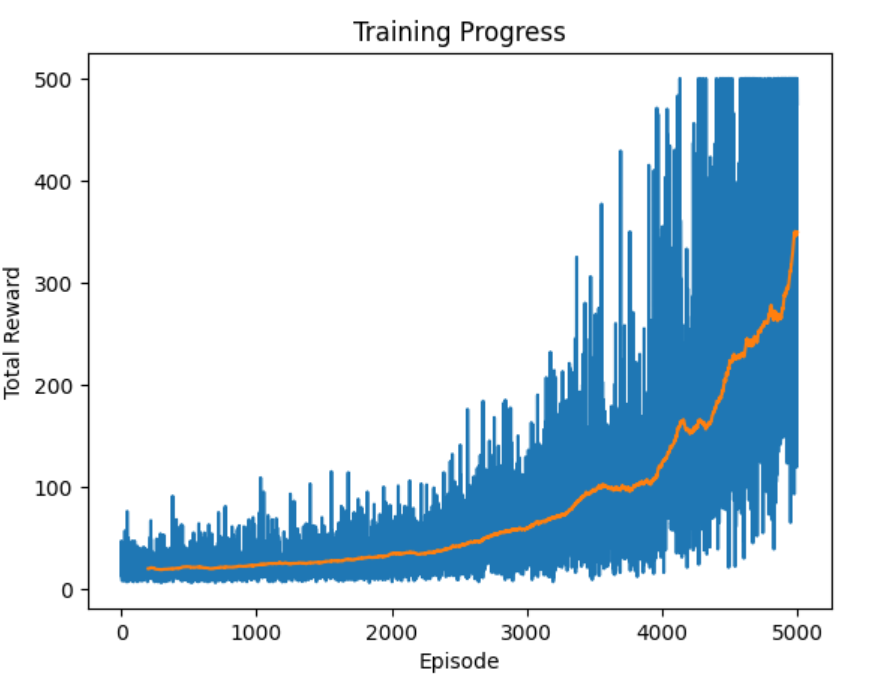
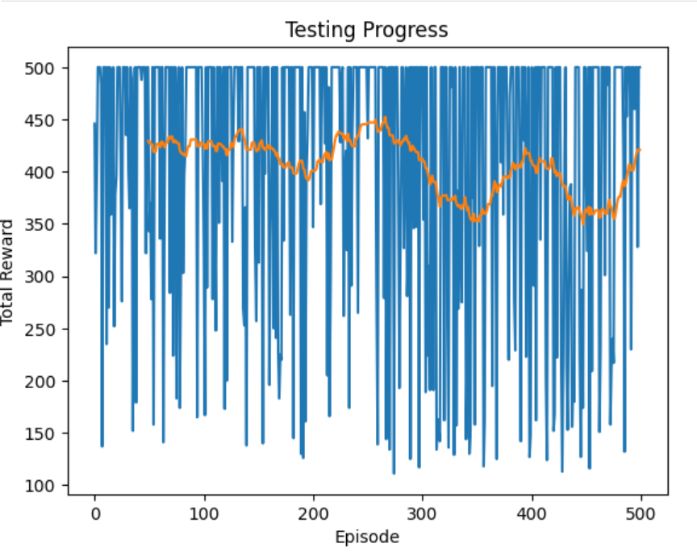
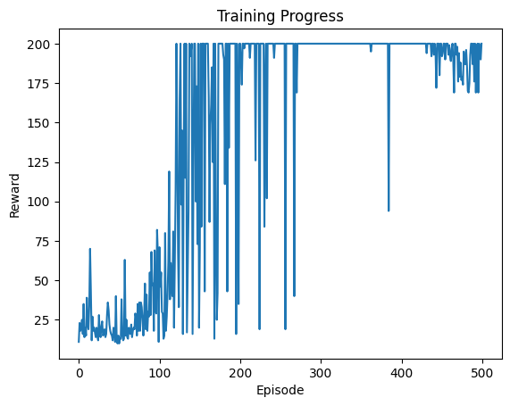
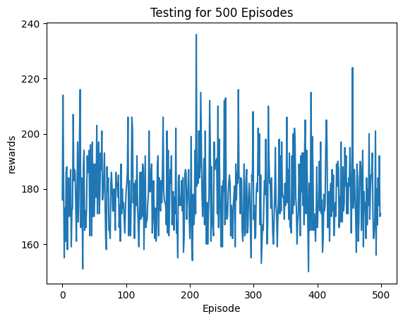
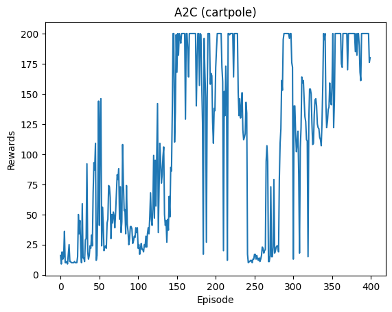
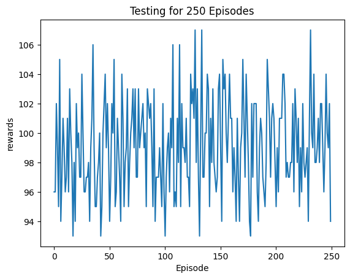
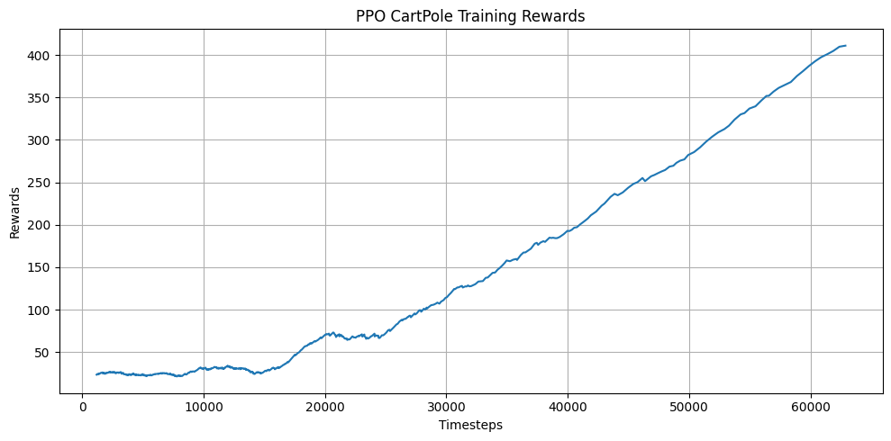
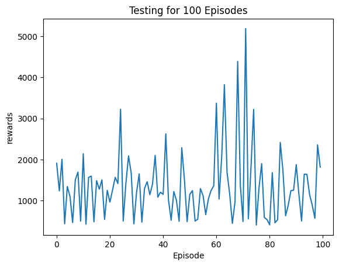

#  Deep Reinforcement Learning on CartPole: DQN, A2C, PPO and Tile Coding

This repository provides implementations of various Deep Reinforcement Learning (DRL) algorithms for solving OpenAI Gym's **CartPole-v1** environment.  

[](https://pytorch.org/)  
[](https://stable-baselines3.readthedocs.io/)  

###  Implementations Included:  
- **Deep Q-Network (DQN)** and **Advantage Actor-Critic (A2C)** implemented from scratch using **PyTorch**.  
- **Proximal Policy Optimization (PPO)** using **Stable Baselines3**.  
- **Q-Learning with Tile Coding** for handling continuous state spaces.  

---

##  Key Features  

| **Category**               | **Algorithms**          | **Key Improvements**                          |
|----------------------------|-------------------------|-----------------------------------------------|
| **From Scratch (PyTorch)** | DQN, A2C                | Experience replay, target networks, advantage estimation |
| **Stable-Baselines3**      | PPO                     | Clipped objectives, parallelized training     |
| **Discretization**         | Q-Learning + Tile Coding| 4 tilings, adaptive ε-greedy, state aggregation |

---

<div align="center">
  
</div>

### 🔹 **Scratch Implementations (PyTorch)**
- **Deep Q-Network (DQN)**  
  - Uses experience replay and target networks for stability.  
  - Implemented from scratch in PyTorch.  

- **Advantage Actor-Critic (A2C)**  
  - Policy-based method using actor and critic networks.  
  - Trained using advantage estimation.  

### 🔹 **Stable Baselines3 Implementation**
- **Proximal Policy Optimization (PPO)**  
  - Implements policy optimization with clipping and advantage estimation.  
  - Uses Stable Baselines3 for efficient training.  

### 🔹 **Q-Learning with Tile Coding**
- **Tile Coding for State Discretization**  
  - 4 tilings with adaptive granularity.  
  - Custom discretization of position, velocity, angle, and angular velocity.  

- **Optimized Learning Parameters**  
  - **Exploration:** Decaying ε-greedy (1.0 → 0.01).  
  - **Learning Rate:** Adaptive schedule (0.5 → 0.1).  
  - **Discount Factor:** γ = 0.99.  

---
## 📈 Training Progress  

Below are the training and testing performance graphs for different reinforcement learning algorithms. All plots are scaled uniformly for a clean and professional appearance.

### 🔹 **Q-Learning with Tile Coding**  
<div align="center">
  
  
</div>  

### 🔹 **Deep Q-Network (DQN)**  
<div align="center">
  
  
</div>  

### 🔹 **Advantage Actor-Critic (A2C)**  
<div align="center">
  
  
</div>  

### 🔹 **Proximal Policy Optimization (PPO)**  
<div align="center">
  
</div>
<div align="center">
  
</div>

## 🛠 Installation  

To get started, clone this repository and install dependencies:

```bash
git clone https://github.com/ak-1203/DRL-Algorithms-in-Cartpole-Environment

pip install gymnasium numpy matplotlib pandas tqdm stable-baselines3 torch
```

##  Planned Updates
- Implement Soft Actor-Critic (SAC) for continuous action spaces.
- Extend tile coding to other environments like MountainCar.
- Experiment with different network architectures for A2C and PPO
